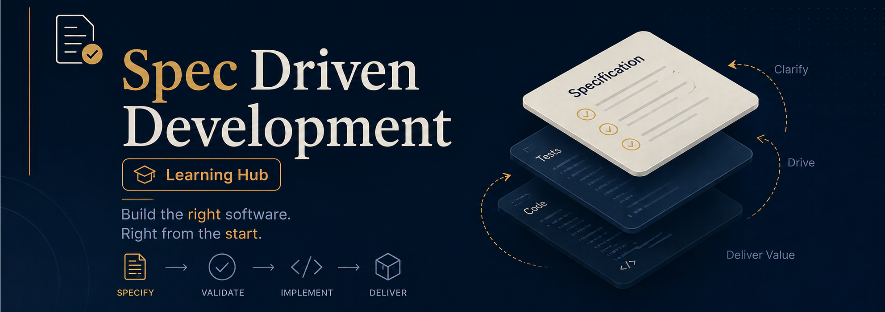

# 📋 Spec-Driven Development Learning Hub

> A curated collection of resources for mastering Spec-Driven Development (SDD) and building better software with specifications and AI-powered tools.

## 📚 Table of Contents

- [🚀 Introduction](#-introduction)
- [⚡ Quickstarts](#-quickstarts)
- [🔍 In-Depth Resources](#-in-depth-resources)
- [🎓 Courses](#-courses)
- [🛠️ Tools & Frameworks](#️-tools--frameworks)
- [💡 Related Concepts](#-related-concepts)
- [💻 GitHub Repos](#-github-repos)
- [💬 Community Discussions](#-community-discussions)
- [➕ Extra Resources](#-extra-resources)

## 🚀 Introduction

Get started with the fundamentals of Spec-Driven Development:

- **[Spec-driven development](https://thoughtworks.medium.com/spec-driven-development-d85995a81387)** - ThoughtWorks Medium
- **[Spec-driven development with AI: Get started with a new open source toolkit](https://github.blog/ai-and-ml/generative-ai/spec-driven-development-with-ai-get-started-with-a-new-open-source-toolkit/)** - GitHub Blog

#### 📺 Videos
- **[Spec-driven development](https://www.youtube.com/watch?v=iHjlRB93okg)** - Devsplainers
- **[Spec-Driven Development in the Real World](https://www.youtube.com/watch?v=3le-v1Pme44)** -Brian Casel

## ⚡ Quickstarts

Get up and running quickly with these hands-on tutorials:

#### 📺 Videos

##### 🎬 Net Ninja Tutorials

- **[Spec Driven Workflow with Claude Code #1 - Making a /spec Command](https://www.youtube.com/watch?v=e_D9M_MJ9Hs)** - Step-by-step guide to creating a spec command
- **[Spec Driven Workflow with Claude Code #2 - Creating a New Spec](https://www.youtube.com/watch?v=JnHUZ8037zE)** - Learn how to create and structure specs

## 🔍 In-Depth Resources

Deep dive into advanced concepts and techniques:

- **[Understanding Spec-Driven-Development: Kiro, spec-kit, and Tessl](https://martinfowler.com/articles/exploring-gen-ai/sdd-3-tools.html)** - Martin Fowler
- **[Using spec-driven development with Claude Code](https://heeki.medium.com/using-spec-driven-development-with-claude-code-4a1ebe5d9f29)** - Heeki Medium
- **[Chapter 16: Spec-Driven Development with Claude Code](https://agentfactory.panaversity.org/docs/General-Agents-Foundations/spec-driven-development)** - Panaversity
- **[Structured-Prompt-Driven Development (SPDD)](https://martinfowler.com/articles/structured-prompt-driven/)** - Martin Fowler
- **[Claude Code for Spec-Driven Development: Capabilities and Limits](https://www.augmentcode.com/guides/claude-code-spec-driven-development)** - AugmentCode
- **[Spec Driven Development with Claude Code: Reduce Approval Overhead & Context Switching with Sub-Agents](https://www.augmentcode.com/guides/claude-code-spec-driven-development)** - AugmentCode
- **[Agentic Coding: GSD vs Spec Kit vs OpenSpec vs Taskmaster AI: Where SDD Tools Diverge](https://pub.spillwave.com/agentic-coding-gsd-vs-spec-kit-vs-openspec-vs-taskmaster-ai-where-sdd-tools-diverge-0414dcb97e46)**

## 🎓 Courses

Structured learning paths for hands-on practice:

#### Free

- **[Spec-Driven Development with Coding Agents](https://www.deeplearning.ai/short-courses/spec-driven-development-with-coding-agents)** - DeepLearning.AI

#### Paid

- **[Claude Code Masterclass](https://netninja.dev/p/claude-code-masterclass)** - Net Ninja

## 🛠️ Tools & Frameworks

Essential tools and frameworks for implementing SDD:

- **[Tessl](https://docs.tessl.io/)** - Complete documentation and guides
- **[KIRO](https://kiro.dev/)** - Specification and implementation tools
- **[spec-kit](https://github.com/github/spec-kit)** - Official GitHub toolkit
- **[GitHub Spec Kit Guide](https://developer.microsoft.com/blog/spec-driven-development-spec-kit)** - Microsoft Developer Blog
- **[The BMad Method](https://docs.bmad-method.org/)** - The BMad Method (Build More Architect Dreams)
- **[Agent OS](https://github.com/buildermethods/agent-os)** - Agent OS Github

## 💡 Related Concepts

Understanding foundational concepts that complement SDD:

- 🎯 **[Bitter Lesson](https://en.wikipedia.org/wiki/Bitter_lesson)** - Wikipedia
- 🏗️ **[Abstraction First](https://martinfowler.com/articles/structured-prompt-driven/abstraction-first.html)** - Martin Fowler

## 💻 GitHub Repos

Implementations and examples of Spec-Driven Development:

- **[open-spdd](https://github.com/gszhangwei/open-spdd/tree/v0.4.9)** (v0.4.9) - Open-source spec-driven development framework
- **[token-billing](https://github.com/gszhangwei/token-billing)** - Token billing implementation with SDD principles

## 💬 Community Discussions

Join the conversation about Spec-Driven Development:

- 🔗 [Hacker News Discussion](https://news.ycombinator.com/item?id=45935763)
- 🔗 [Reddit: r/ClaudeCode](https://www.reddit.com/r/ClaudeCode/comments/1rg0b9i/has_anyone_tried_the_spec_driven_development/)

## ➕ Extra Resources

Additional guides and practical tutorials:

- 📘 **[A Practical Guide to Spec-Driven Development](https://docs.zencoder.ai/user-guides/tutorials/spec-driven-development-guide#spec-driven-implementation)** - Zencoder

## 📖 Glossary

### Spec Drift
When the actual implementation diverges from the original specification over time. This occurs when code changes are made without updating the corresponding spec, causing inconsistency between the spec and reality.

### Determinism Problem
When feeding the same specification to an AI model multiple times, you may receive different code outputs each time. This non-deterministic behavior makes it challenging to ensure consistency and reproducibility in spec-driven development workflows with AI-powered code generation.

---

**Happy Learning! 🚀**

*Feel free to contribute additional resources or insights to this collection.*

